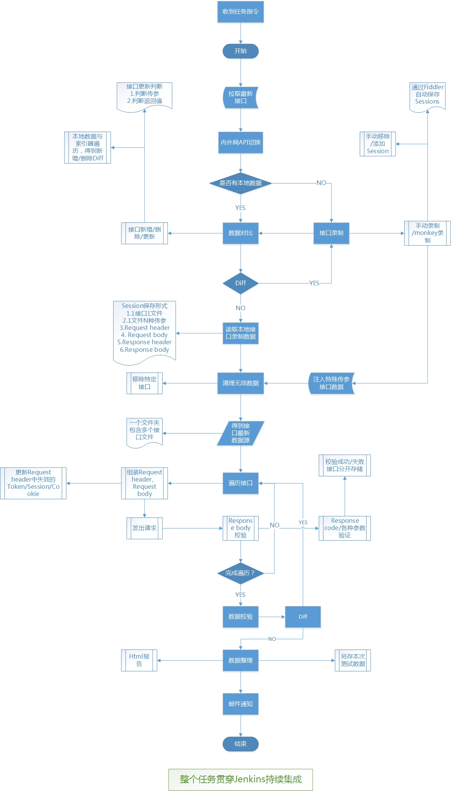

# ApiTests
**ApiTests**是一个快速验证接口正确性的框架，主要用于回归验证，亦可用于接口测试（需要拓展，目前还未支持，考虑后面加上）。

#### 功能

具体查看框架思路，红色部分未完成。

- 接口只需录制一次，后续只需维护变动的接口

- 目前仅支持http的post请求方式，get以及https后续考虑加上，亦可自己完善
- 快速的接口反馈，通常一分钟内完成，取决于机器/网络因素
- 日常监控，后续加上
- 可以屏蔽特殊接口

#### 框架目前状态

- 部分功能未实行，核心功能已完成
- response body需要更详细的验证（进行中）
- 日常监控对外网数据还有影响，目前只是屏蔽接口（后续改为删除数据接口传参id根据创建数据接口id填充）

#### 框架思路

#### 使用方式

- 环境配置
  - Python 3.x
  - fiddler一枚（配置抓取手机请求）
  - PyCharm 

- token/session替换
  - 替换成你们项目对应的token等
  - 修改配置文件
  - 修改response body json 判断逻辑

- 运行方式
  - 总入口在项目的launcher文件夹下面的RequestApi.py